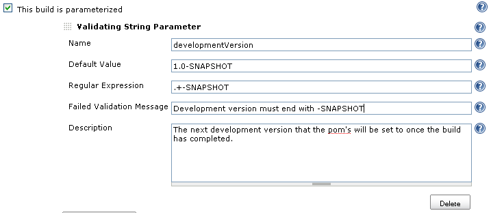
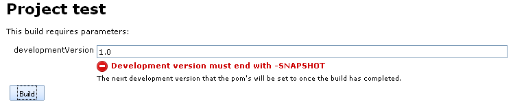
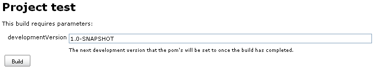

# Validating String Parameter Plugin

The validating string parameter plugin contributes a new parameter type
to Jenkins that supports regular expression validation of the user's
entered parameter.

# Usage

This plugin is used wherever build parameter selection is available,
most commonly in the job configuration page by enabling parameterized
builds (this parameter type will also be available as release parameters
using the [release
plugin](https://plugins.jenkins.io/release/)).

Configure the parameter by entering a name, regular expression to
validate the entered value and optionally a default value, an error
message shown when the user entered value fails the regular expression
check and a parameter description.  

When a build is requested, the user will be prompted with the parameters
to enter. Users enter the parameter as normal, but will now be prompted
with an error message if the entered value does not meet the regular
expression.

 

Once the entered value meets the configured regular expression, the
error message is no longer displayed.

